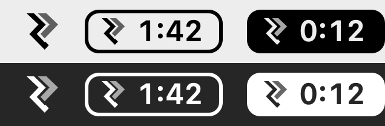

# MyTime

A small, local-only time tracker and invoicing app for macOS, built for a one-person consultancy.

I'd used Harvest for years. It's a good product, but most of what I paid for was a timer, a timesheet and an
invoice PDF. MyTime does those three things natively on the Mac. It has no account and no server, and your data
never leaves your machine unless you back it up to iCloud Drive yourself.



*The menu bar item in light and dark mode. From left to right: nothing tracked today, stopped (outlined, showing
today's total), and running (filled, showing the current timer).*

## Features

- **Menu bar timer**
  - Pick a project, then a task, and start the timer. The popover remembers your last choice.
  - Edit, add or delete today's entries without opening the main window.
  - Global shortcuts: <kbd>⌥⌘T</kbd> opens the timer and <kbd>⌥⌘S</kbd> starts or stops the last task.
  - A running timer survives quitting, sleep, crashes and reboots. Only the start timestamp is stored, and
    elapsed time is always worked out from it.
- **Timesheet**
  - Day and week views, click-to-edit entries, and totals for today, the week, billable time and uninvoiced time.
- **Real time, not decimals**
  - Everything is shown as `h:mm`. Money is calculated from exact whole minutes, so 0:41 at $150/h is $102.50.
    Nothing is rounded to 0.68 h first.
- **Clients, projects and tasks**
  - Rates cascade from task to project to client.
  - Fixed-fee projects, client logos, and archiving.
  - A default task list you can apply across every project, with tools to merge old one-off tasks into it.
- **Invoicing**
  - Build an invoice from tracked time or from scratch.
  - Group lines by project and task, or add fixed-amount lines.
  - Hours can be *billed*, *covered* by a fixed-fee line, or *written off*, so fixed-price work never leaves
    hours stuck as "uninvoiced".
  - Invoices are snapshotted, so changing a rate later never alters one you've already sent.
  - Generates an A4 tax invoice PDF (multi-page, with GST) and opens it as a draft in Apple Mail from the address
    you choose.
- **Backups**
  - A daily, zipped SQLite snapshot goes to iCloud Drive. Restore is one click from Settings.

## Requirements

- macOS 15 or later
- Xcode 16 or later
- [XcodeGen](https://github.com/yonaskolb/XcodeGen): `brew install xcodegen`

## Build and run

```bash
git clone https://github.com/revilo-digital/mytime-app.git
cd mytime-app
./scripts/install.sh
```

`install.sh` does four things:
1. Generates the Xcode project.
2. Builds a Release copy.
3. Installs it to `/Applications` and launches it.
4. If iCloud Drive is on, saves a zipped copy of the app to iCloud Drive › MyTime Backups › App, so you can
   reinstall without Xcode.

The app is signed ad hoc for local use. It isn't notarised, so it's not meant for distribution as-is.

To work on it in Xcode instead:

```bash
xcodegen generate
open MyTime.xcodeproj
```

## Tests

```bash
xcodegen generate
xcodebuild test -project MyTime.xcodeproj -scheme MyTime -destination 'platform=macOS'
```

The tests use Swift Testing with an in-memory store. They cover the timer (including crash recovery), rate
resolution, invoice building and totals, PDF layout, backups and restore, and the task-template tools.

## First run

1. Open **Settings → Business** and enter your trading name, address, GST number (optional) and bank details.
   These appear on your invoices.
2. Open **Settings → Tasks** to review the default task list, then add your first client and project.
3. Click the chevrons in the menu bar and start a timer.

The defaults are New Zealand ones: NZD, 15% GST, dd/MM/yyyy dates, and invoices due on the 20th of the following
month. Tax rate and payment terms can be changed in Settings. Currency and date format are currently set in
`MyTime/Utilities/Money.swift`.

## Where your data lives

| What | Where |
| --- | --- |
| Database (SwiftData / SQLite) | `~/Library/Application Support/MyTime/MyTime.store` |
| Invoice PDFs | `~/Library/Application Support/MyTime/Invoices/` |
| Backups (last 30 daily, plus manual ones) | iCloud Drive › MyTime Backups |

To move to a new Mac, install the app, then go to **Settings → Backup → Restore from File…** and pick the
latest backup zip. MyTime swaps the data in and relaunches.

## How it's built

- **SwiftUI and SwiftData**, with Swift 6 strict concurrency and no server.
- **One dependency:** [KeyboardShortcuts](https://github.com/sindresorhus/KeyboardShortcuts) for the global
  hotkeys.
- **Money is `Decimal` throughout.** GST is rounded once, on the invoice subtotal. You can optionally round each entry up to a billing increment (e.g. 6 or 15 minutes) in Settings. It is off by default.
- **The invoice PDF is drawn from the same SwiftUI view as the on-screen preview**, and paginated manually.
- **The menu bar item is drawn as a template `NSImage`.** `MenuBarExtra` labels only render plain text and
  images, and this lets macOS tint it for light and dark menu bars.

This app was designed and built with [Claude Code](https://claude.com/claude-code), with me as product owner and
reviewer.

## License

The code is released under the [MIT License](LICENSE). The chevron mark in the app icon and menu bar is the
Revilo Digital logo. It isn't covered by the licence, so please swap in your own if you fork the app.
